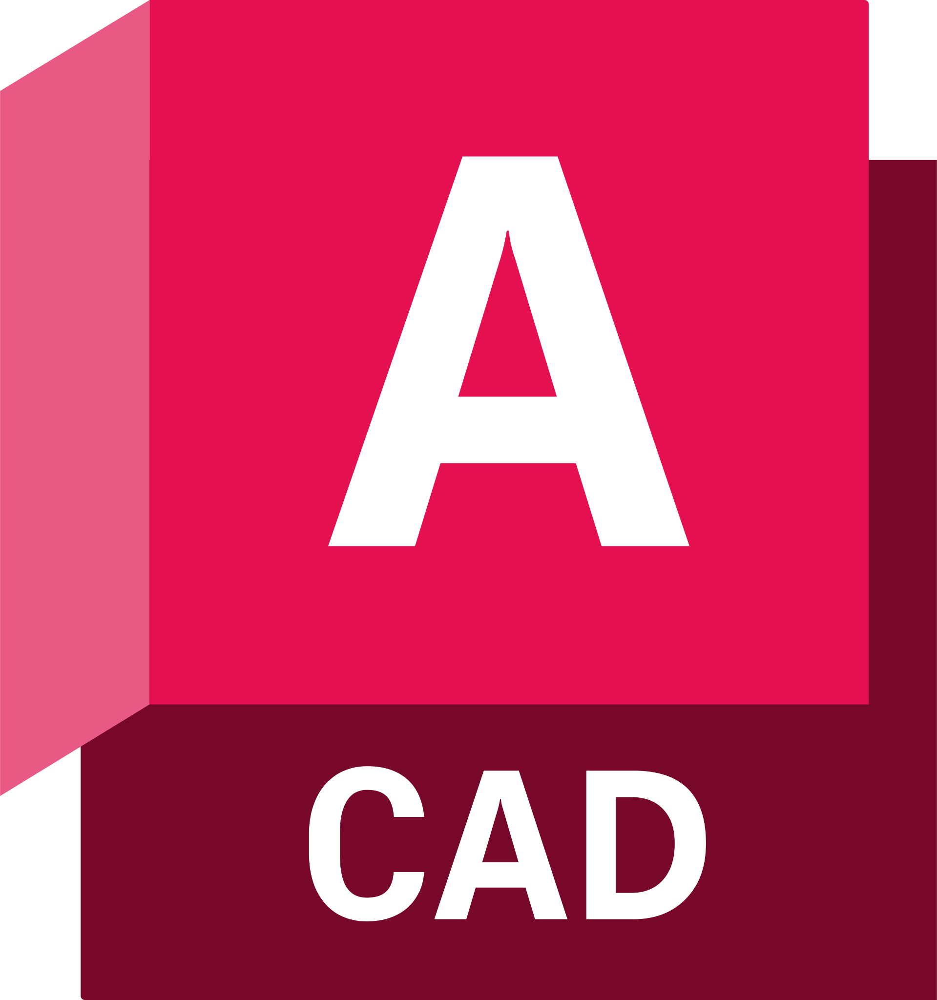

<p align="center">
  
  <h1 align="center">AutoCAD — Guía de Aprendizaje: De Cero a Experto</h1>
  <p align="center">
    <em>Sitio web educativo interactivo para aprender AutoCAD desde cero hasta nivel avanzado, con soporte bilingüe (ES/EN).</em>
  </p>
  <p align="center">
    <a href="https://apaza-victor.github.io/Gu-a-de-Autocad/"></a>
    <a href="#"></a>
    <a href="#"></a>
    <a href="#"></a>
    <a href="#"></a>
  </p>
</p>

---

## 📚 Contenido

### Niveles de aprendizaje <small>(123 lecciones en total)</small>

| Nivel | Tema | Lecciones | Contenido |
|:-----:|------|:---------:|-----------|
| 1 | Fundamentos | 37 | Interfaz, coordenadas, referencias, 24 herramientas de dibujo/modificación, capas, propiedades, acotación, texto, sombreado, bloques |
| 2 | Dibujo 2D | 29 | Herramientas de dibujo, modificaciones, selección, precisión, capas, bloques, organización |
| 3 | Organización | 20 | Capas, bloques, plantillas, cotas, estilos de texto, escala |
| 4 | Modelado 3D | 19 | UCS, sólidos primitivos, extrusión, booleanos, mallas, render |
| 5 | Avanzado | 18 | Diseño paramétrico, Dynamic Blocks, AutoLISP, XREF, rendimiento |

### Secciones complementarias

- **Diccionario de comandos** — 979 comandos con búsqueda, filtros por categoría y teclas de acceso rápido
- **Ejemplos visuales** — diagramas SVG paso a paso que muestran antes/después de cada comando
- **Trucos y atajos** — tips de aprendizaje, atajos de teclado, errores comunes y flujo de trabajo
- **Recursos** — 19 recursos descargables: bloques, cursos, comunidades, plantillas, canales de YouTube, herramientas y chuleta de atajos en PDF
- **Preguntas frecuentes** — 15 respuestas sobre instalación, rendimiento, compatibilidad, funciones y aprendizaje
- **Autoevaluaciones** — quiz interactivos por nivel con 5 preguntas de repaso desplegables

---

## ✨ Funcionalidades

- **Soporte bilingüe (ES/EN)** — traducciones completas de interfaz, comandos y contenido vía sistema i18n
- **Tema oscuro/claro** — toggle con persistencia en `localStorage`, detección automática de preferencia del sistema (`prefers-color-scheme`)
- **Progreso de aprendizaje** — cada tema se marca como visto, con barra de progreso global
- **Buscador global** — búsqueda inteligente con fuzzy matching (Fuse.js), atajo `Ctrl+K`
- **Filtros de comandos** — 14 categorías: Dibujo, Modificación, Precisión, Capas, Acotación, Texto, Bloques, Edición, 3D, Consulta, Archivo, Vista, Utilidades, Render
- **Carruseles** — galerías interactivas con Swiper.js
- **Bloques de código** — con resaltado de sintaxis (Prism.js) y botón de copiar
- **Diagramas SVG** — visualizaciones paso a paso integradas en cada lección
- **Navegación por teclado** — FAQ accesible con Enter/Espacio, filtros con flechas
- **Tabla de atajos descargable** — exporta los atajos a un archivo TXT
- **Accesibilidad** — skip-to-content link, estilos de foco visibles (`:focus-visible`), contraste WCAG AA, soporte `prefers-reduced-motion`
- **Impresión** — estilos `@media print` que ocultan navbar, sidebar, barra de comandos y footer
- **Diseño responsive** — funciona en desktop, tablet y móvil

---

## 🧰 Tecnologías

| Tecnología | Uso |
|------------|-----|
| HTML5 | Estructura semántica |
| CSS3 | Diseño personalizado con variables CSS, `@media print`, `prefers-reduced-motion` |
| Bootstrap 5.3 | Grid, componentes, utilidades |
| Bootstrap Icons | Iconografía |
| JavaScript vanilla | Lógica, interacción, almacenamiento local |
| Fuse.js 7.0 | Búsqueda fuzzy en el diccionario de comandos |
| Swiper.js 11 | Carruseles de ejemplos |
| Prism.js 1.29 | Resaltado de código y sintaxis |
| AOS 2.3 | Animaciones al hacer scroll |
| Python 3 | Scripts generadores de contenido (bajo `scripts/`) |

---

## 📁 Estructura del proyecto

```
Guia de Autocad/
├── index.html                  # Pagina principal
├── assets/
│   ├── css/
│   │   ├── style.css           # Estilos base del sitio
│   │   └── responsive.css      # Breakpoints, print y reduced-motion
│   ├── js/
│   │   ├── main.js             # Funcionalidad JS compartida
│   │   ├── i18n.js             # Sistema de traduccion ES/EN
│   │   ├── search-index.js     # Indice generado para el buscador global
│   │   ├── quiz.js             # Autoevaluaciones de cada nivel
│   │   ├── animations.js       # Animaciones y micro-interacciones
│   │   └── babylon-lab.js      # Laboratorio 3D interactivo (nivel 4)
│   └── img/
│       └── autocad-2.svg       # Logo AutoCAD (navbar, footer, favicon)
├── paginas/
│   ├── nivel-1-fundamentos/    # Nivel 1 (portada + 37 lecciones)
│   ├── nivel-2-dibujo-2d/      # Nivel 2 (portada + 29 lecciones)
│   ├── nivel-3-organizacion/   # Nivel 3 (portada + 20 lecciones)
│   ├── nivel-4-modelado-3d/    # Nivel 4 (portada + 19 lecciones)
│   ├── nivel-5-avanzado/       # Nivel 5 (portada + 18 lecciones)
│   ├── nivel-1-fundamentos.html  # Redireccion a la carpeta (compatibilidad)
│   ├── nivel-2-dibujo-2d.html    # Redireccion a la carpeta (compatibilidad)
│   ├── nivel-3-organizacion.html # Redireccion a la carpeta (compatibilidad)
│   ├── nivel-4-modelado-3d.html  # Redireccion a la carpeta (compatibilidad)
│   ├── nivel-5-avanzado.html     # Redireccion a la carpeta (compatibilidad)
│   ├── comandos.html           # Diccionario de 979 comandos
│   ├── ejemplos-visuales.html  # Diagramas paso a paso
│   ├── trucos.html             # Atajos y tips
│   ├── recursos.html           # Enlaces y plantillas
│   └── faq.html                # Preguntas frecuentes
├── scripts/                    # Generadores de contenido (Python)
│   ├── build_level1_content.py # ... build_level5_content.py
│   ├── build_level_folders.py  # Navegacion, portadas y totales
│   ├── add_new_lessons.py      # Registro de lecciones nuevas (123 temas)
│   ├── localize_commands.py    # Localizacion bilingue de comandos
│   ├── process_house.py        # Utilidad de procesamiento
│   └── lessons_data/           # Fragmentos HTML reutilizables por leccion
└── README.md
```

---

## 🚀 Despliegue

El sitio está desplegado en **GitHub Pages** desde la rama `main`.

Para ejecutarlo localmente, simplemente abre `index.html` en tu navegador.

---

## ⚙️ Regenerar el contenido

Las lecciones, portadas y totales se generan con Python. Para actualizar el sitio tras añadir contenido:

```bash
python scripts/add_new_lessons.py    # Registra lecciones, totales, search-index y sitemap
python scripts/localize_commands.py  # Localiza comandos al espanol/ingles
```

---

## 👤 Autor y copyright

**Autor:** Victor Apaza — [GitHub](https://github.com/Apaza-Victor)

**© 2026 Victor Apaza. Todos los derechos reservados.**

Este sitio es contenido educativo independiente. No es un sitio oficial de Autodesk®; AutoCAD® es una marca registrada de Autodesk, Inc.